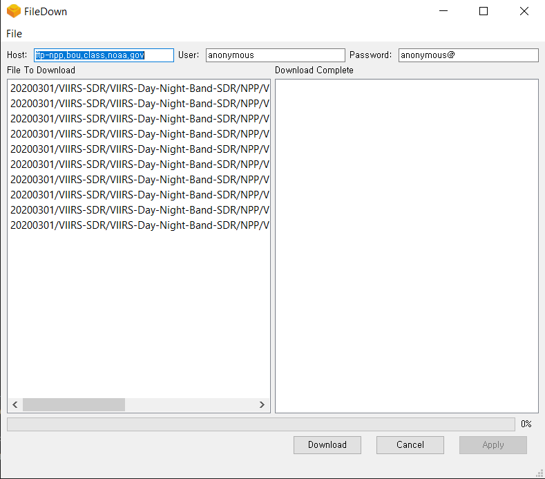

## filedown - FTP 파일 다운로더

### Description
- 설정파일 (`config.yml`) 에 지정된 FTP 디렉터리 파일을 지정한 디렉터리에 다운로드하는 프로그램




### Installtion

- 파이썬 가상환경 설정
```python
# 가상환경 설치
python -m venv venv

# 가상환경 활성화
# Linux
source venv/Scripts/activate
# Windwos
./venv/Scripts/activate.bat
```

- 라이브러리 설치

```python
pip install -r requirements.txt
```

- 프로그램 실행

```python
fbs run
```

