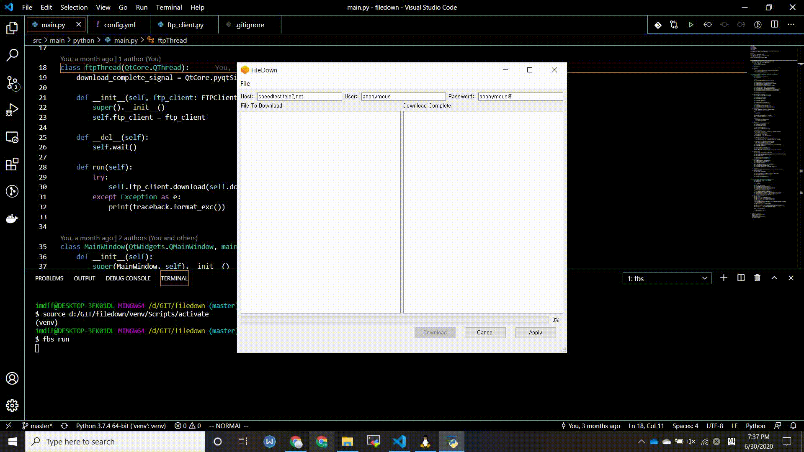

## filedown - FTP 파일 다운로더

### Description
- 설정파일 (`config.yml`) 에 지정된 FTP 디렉터리 파일을 지정한 디렉터리에 다운로드하는 프로그램



- 설정 파일(*.yml) 정보
  - `url` : ftp 경로
  - `username` : 해당 ftp 서버의 id
  - `password` : 해당 ftp 서버의 비밀번호
  - `remote_dirs` : 다운 받을 경로 (url 기준 상대경로), 여러 개 설정 가능
  - `local_dirs` : 다운받을 디렉터리 경로 `remote_dirs` 당 1개씩 매칭
  - `passive_mode` : ftp 접속 시 passive 모드 또는 active 모드 설정
  - `pattern` : 정규표현식 이용, 매칭 되는 파일명만 다운로드


### Installtion

- 파이썬 가상환경 설정
```python
# 가상환경 설치
python -m venv venv

# 가상환경 활성화
# Linux
source venv/Scripts/activate
# Windwos
./venv/Scripts/activate.bat
```

- 라이브러리 설치

```python
pip install -r requirements.txt
```

- 프로그램 실행

```python
fbs run
```

### Updates
- [Notion Page](https://www.notion.so/FileDown-FTP-Downloader-456b11b7e16d409998b3a6e3b89bef9d)
